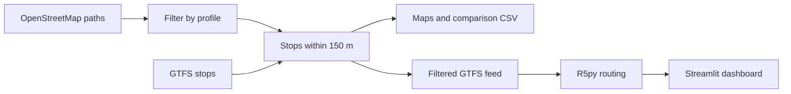

# Accessibility-Aware Routing (Prototype)

A Python prototype that explores how public transport access changes for people with different mobility needs. It filters OpenStreetMap walking paths by accessibility tags for each user profile, finds which bus and rail stops remain reachable, and runs travel-time routing with [R5py](https://r5py.readthedocs.io/).

*Prototype developed as part of my MSc Computer Science dissertation at the University of Exeter.*

> **Status: early prototype.** The core pipeline works end to end on a small test area. Known limitations are listed openly below, with planned fixes in the roadmap.

## Why this matters

Most transport models are built around the average pedestrian. That overestimates how much of the network is usable for wheelchair users and older people, and underestimates how long their journeys take. This project tests a simple idea: filter the walking network by each group's needs first, then measure what they can actually reach.

## What the code does

1. **Fetches walking paths** (`highway=footway`) and their tags from OpenStreetMap via the Overpass API, for a small test area in central London near Trafalgar Square.
2. **Filters paths for each profile** using OpenStreetMap tags such as surface, smoothness, incline and wheelchair access.
3. **Loads public transport stops** from a GTFS timetable feed and finds stops within 150 m of each profile's accessible paths.
4. **Draws an interactive map** per profile, showing accessible paths and reachable stops.
5. **Compares profiles** and saves which stops are shared or unique to each profile.
6. **Runs R5py routing** on a timetable limited to each profile's reachable stops, then adjusts travel times for each profile's walking speed.
7. **Shows results** in a Streamlit dashboard.



## User profiles

| Profile | Walking speed (m/s) | Path filters |
|---|---|---|
| Normal (baseline) | 1.4 | None |
| Wheelchair | 0.9 | `wheelchair=yes`; surface asphalt, paving stones, concrete or paved; smoothness excellent, good or intermediate; incline up, down or untagged |
| Elderly | 0.8 | Surface asphalt, paving stones, concrete or paved; smoothness good or intermediate; incline up, down or untagged |

## Known limitations

- **Routing uses the unfiltered walking network.** Profile filtering decides which stops count as reachable, but R5py routes over the full OpenStreetMap network, so walking routes are not restricted by the profile rules.
- **Run order issue.** The GTFS filtering step reads the comparison CSV before `main.py` writes it, so a fresh run fails and later runs use the previous run's results.
- **Walking speeds are applied after routing,** by scaling travel times, rather than inside the routing itself.
- **One test journey.** Routing uses a single fixed origin and destination.
- **Small study area,** a few hundred metres across.
- **Partial GTFS clean-up.** Removed stops are dropped from `stops.txt` and `stop_times.txt` only, not from trips or routes.
- **Missing OpenStreetMap tags** affect results, because untagged paths are removed by most filters.

## Roadmap

- [ ] Build each profile's routing network from its filtered paths
- [ ] Fix the run order so the comparison CSV is created before routing
- [ ] Pass walking speeds into R5py instead of scaling results
- [ ] Route between many sampled origins and destinations
- [ ] Add blind and child profiles, with rules for stairs, slopes, crossings and lighting
- [ ] Extend to a wider area of London
- [ ] Clean up trips and routes when stops are removed

## Tech stack

Python · R5py · GeoPandas · Shapely · gtfs-kit · pandas · Folium · Streamlit · Plotly · Altair

## Project structure

```
accessibility-router/
├── main.py              # Runs the pipeline
├── src/
│   ├── fetch_osm.py         # Downloads OSM paths via the Overpass API
│   ├── process_osm.py       # Converts OSM data into path geometries
│   ├── profiles.py          # Profile definitions
│   ├── filter_by_profile.py # Filters paths by profile tags
│   ├── parse_gtfs.py        # Loads GTFS stops
│   ├── run_r5_routing.py    # Filters GTFS and runs R5py routing
│   └── visualize.py         # Interactive Folium maps
├── dashboard/
│   └── app.py           # Streamlit comparison dashboard
└── outputs/             # Example maps
```

## Getting started

**Requirements:** Python 3.10+ and Java (JDK 21), which R5py needs to run the routing engine.

```bash
git clone https://github.com/VishnuPrakashVP/accessibility-router.git
cd accessibility-router
python -m venv venv
source venv/bin/activate        # Windows: venv\Scripts\activate
pip install -r requirements.txt
```

**Data** (not included because of file size):
- OpenStreetMap: download `greater-london-latest.osm.pbf` from [Geofabrik](https://download.geofabrik.de/europe/united-kingdom/england/greater-london.html) into `r5_inputs/osm/`
- GTFS: download a London feed from the [Bus Open Data Service](https://data.bus-data.dft.gov.uk/) and save it as `r5_inputs/gtfs/gtfs-london.zip`

**Run:**
```bash
python main.py
cd dashboard && streamlit run app.py
```

## Author

**Vishnu Prakash** · [LinkedIn](https://www.linkedin.com/in/vishnuprakashvp2512) · [GitHub](https://github.com/VishnuPrakashVP)
